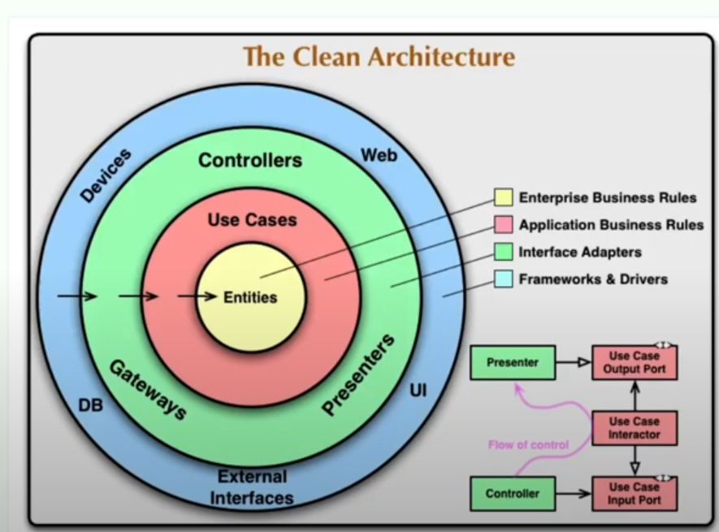

**29-05-25**

# Arquitetura em Camadas

è uma indireção para aumentar a estabilidade do core. Não depender de detalhes de implementação, no core do sistema.

# Pontos importantes

**Principo da regra da depedencia** as camadas externas podem saber detalhes do core, mas o core não pode saber detalhes das camadas externas.

**Crossing boundaries** é utilizar a inversão de dependência.

# Dando nomes as camadas

- **Entities**: são as classes que representam o domínio do negócio, como `Cliente`, `Produto`, etc.
- **Use Cases**: são as classes que implementam a lógica de negócio, como `CriarCliente`, `AtualizarProduto`, etc.
- **Interface Adapters**: são as classes que fazem a comunicação entre o sistema e o mundo externo, como `Controllers`, `Repositories`, etc.



# REfatorando

Você depende de classes criadas por você mesmo aon invez de classes de frameworks ou bibliotecas de terceiros.

1. verificar se a classe é testavel, geralmente utilizar um construtor com as dependências.
2. remover a dependência do banco de dados, poderiamos utilizar um repository ao invez do entity manager.
3. Desacoplar da web.
   - separa a classe que faz o "serviço" e "funcionalidade" em uma classe separada, chamada use case.
   - o controlador usa o caso de uso para executar a lógica de negócio.
   - Inverter as dependências, criar uma interface que vai ser utililzada pelo use case para obeter os dados necessários. Na implementação geralmente é o toModel() ou toEntity() retornando o modelo uma outra opção é utilizar um getters e setters para obter os dados necessários.

No java é possivel criar uma validação do javax.validation.constraints para validar os dados de entrada, como por exemplo:

temos o @VAlidate e @Valid, como é uma classe injetada pelo spring podemos

```java

@Validated
@Service
class CriarClienteUseCase {

 private final ClienteRepository clienteRepository;

 public CriarClienteUseCase(ClienteRepository clienteRepository) {
  this.clienteRepository = clienteRepository;
 }

 public void execute(@Valid ClienteDTO clienteDTO) {
  Cliente cliente = new Cliente(clienteDTO.getNome(), clienteDTO.getEmail());
  clienteRepository.save(cliente);
 }
}
```
