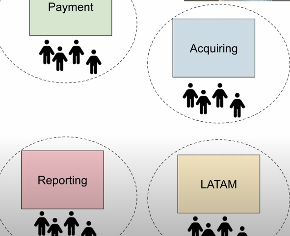

# Autonomia

## Arquiteturas baseadas em eventos

Um bom exemplo de arquitetura baseada em eventos são os sistemas reativos.

* Fazer com que os serviços interajam entre si pode ser complicado:

  * Difícil de coordenar
  * Acoplamento
  * Tratamento de erros e tentativas de repetição em todos os lugares
  * **Coordenação entre equipes**
* Eventos separam produtores de consumidores
* Desvantagens:

  * Difícil de entender o fluxo de dados
  * Difícil de depurar
  * Difícil de monitorar

## Microserviços

**Escalar pessoas**

* Quando se cresce em complexidade e em número de pessoas, tudo precisa de limites (boundaries)
* Microserviços não são uma solução para um problema técnico, mas sim para um problema de pessoas
* Independência e autonomia da equipe
* Dependências custam tempo e dinheiro
* **Trade-off:** sistemas distribuídos são tecnicamente desafiadores

## Topologias de time

* A organização da equipe é fundamental em empresas de grande porte
* A maneira como você organiza suas equipes será refletida na arquitetura do sistema
* **Manobra de Conway reversa**
* Segundo o livro *Team Topologies*, existem 4 tipos de times:

### Tipos de times (Team Topologies)

* **Stream-aligned team**: time de produto
* **Enabling team**: time de suporte, ajuda a resolver problemas de outros times, como migração de React para Vue.js
* **Complicated Subsystem team**: time de especialistas que resolve problemas muito específicos, como sistemas legados
* **Platform team**: time que cria ferramentas e plataformas para os demais times, como uma plataforma de testes automatizados

> Pela Lei de Conway, a divisão dos times impacta diretamente na arquitetura do sistema — e vice-versa.
> A arquitetura deve ser projetada para permitir que os times atuem de forma independente, com autonomia para implementar suas funcionalidades sem dependências externas.

## Papéis e responsabilidades

### Contribuidores individuais

* Engenheiro
* Engenheiro sênior

### Liderança técnica

* Staff engineer (líder técnico do time)
* Principal engineer (liderança técnica geral, focada em soluções entre times)

### Liderança de times

* Tech lead
* Engineering manager

### Produto

* Gerente de produto (Product Manager)

## Ownership (Propriedade)

* **Propriedade fraca vs forte**
  Propriedade fraca é comum em bibliotecas e serviços genéricos.
  A forma como o time lida com mudanças no serviço depende do grau de propriedade.

### Quem é o dono do quê?

* Se houver um bug, quem corrige?
* Em caso de patch de segurança, quem aplica?
* Se for necessário migrar para um novo cluster, quem realiza a migração?

