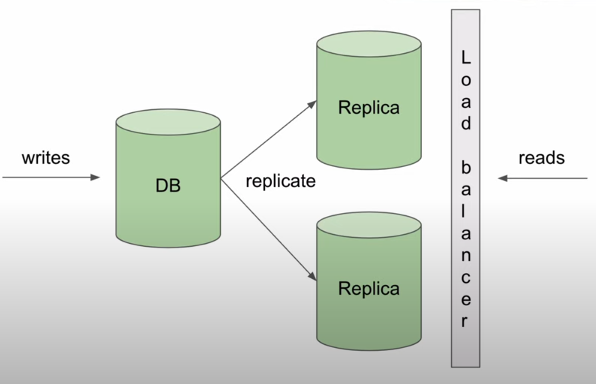
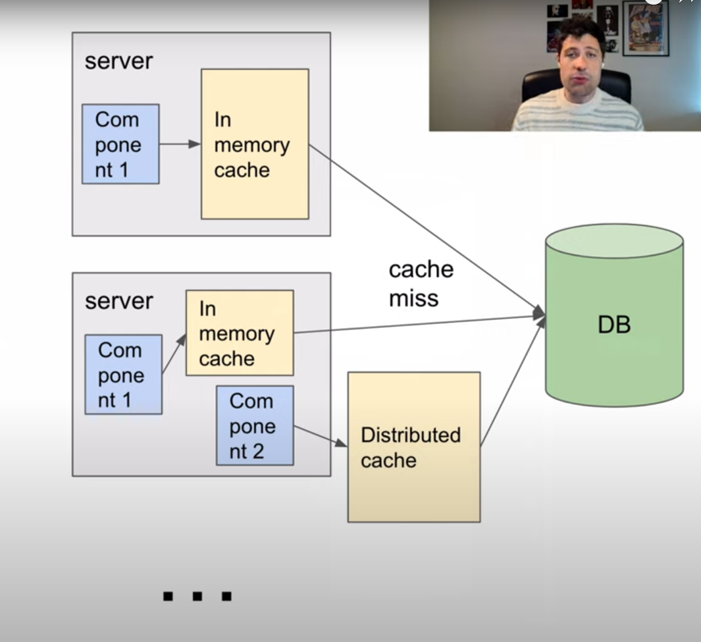
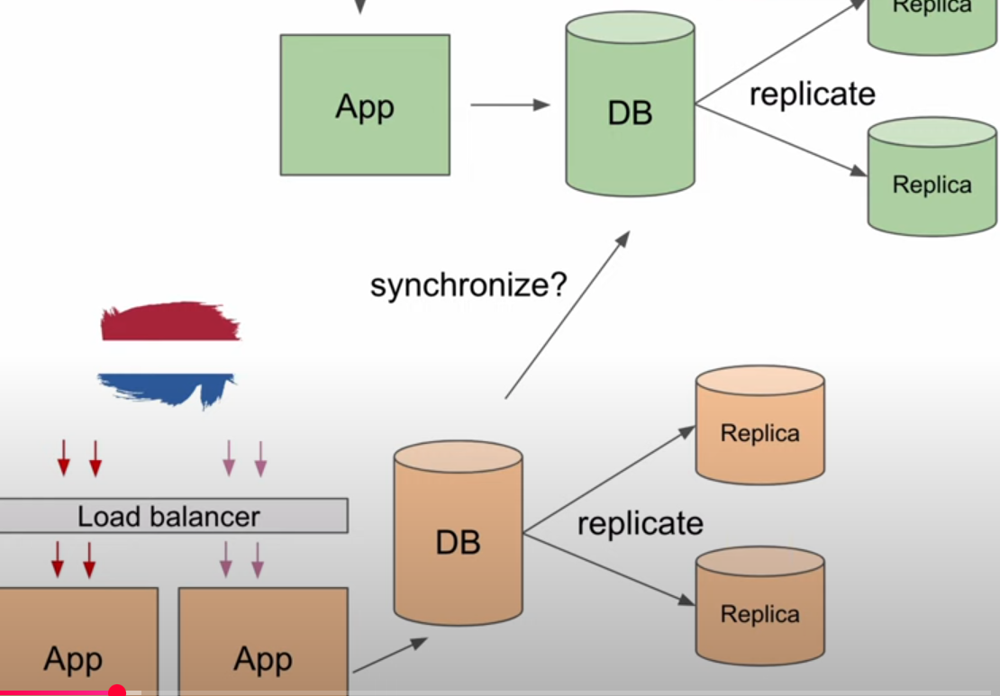
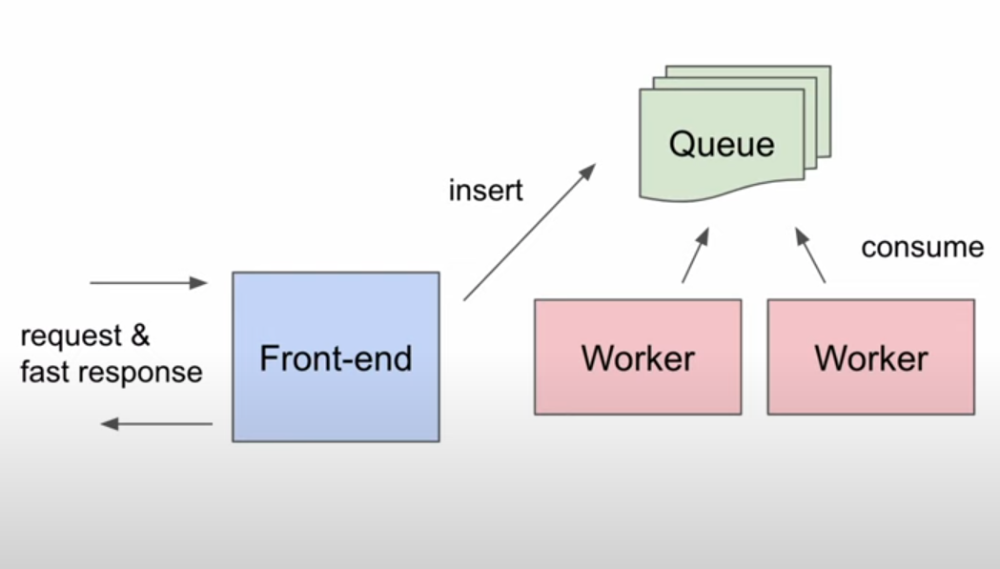
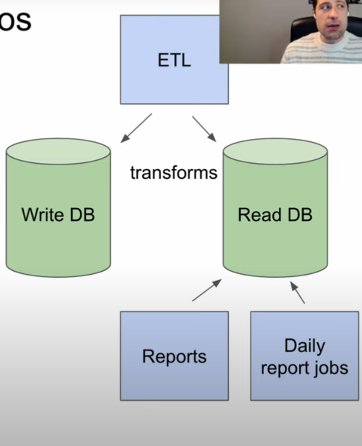

# Escalabilidade

## Replicas de banco de dados

- Consistencia eventual
- replicar aliviar a carga do banco de dados principal

## Caches

- reduzir o nomero de vezes que acessamos o banco de dados
- Na memória, em disco ou distribuído
- consistência eventual
- estratégias de invalidação

## Escala horizontal e regional

- decidir se vair duplicar a aplicação em várias regiões ou não
- decidir como vai ser feita a sincronização entre as regiões

## Processamento assíncrono

- escalabilidade horizontal
- filas de mensagens
- pode afetar a Ux

## BDs de escrita e leitura separados(ETL)

- Query de relatórios
- ETL (Extract, Transform, Load)
- replicação de dados

