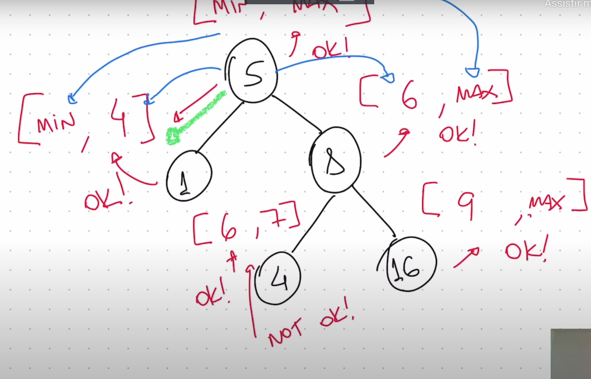

# Arvore binaria

Toda arvore binaria tem no máximo dois filhos, podemos adicionar uma propriedade na arvore binaria que ajuda na buscar, todos que está na esquerda são menores que o nó e todos que estão a direita são maiores que o nó, chamos isso de arvore binaria de buscar.

Em uma busca de uma arvore binaria de buscar é que reduzimo o espaço de busca, a cada passo.

ele gosta de ter um ponteiro novo que aponto para o nó atual

pseudo código

```

funcion search(node, value):
 if node is null:
     return null
 if node.value == value:
  return node
 if value < node.value:
  return search(node.left, value)
 else:
  return search(node.right, value)

```

uma busca binaria é O(log n), a cada passo reduzimos o espaço de busca pela metade, se a arvore for balanceada.


## Validate binary search tree (98)

tente sempre desenha para tentar entender o problema.

pensar como resolver o problema, o promema é que precisamos validar também todos os ancentrais não somente a subarvore atual.

ele resolve criando um intervalo maximo e mínimo, o menor valor herdar do pai os intervalos. precisamos criar um range baseado no no atual sempre hendado. quando vamos para esquerda matenho o minimo do pai e atualizar o valor do máximo, quando vamos para direita mantenho o máximo do pai e atualizo o valor do mínimo.

fazer sempre o algorimo em mesa, é boa prática para entender o problema.

teve um problema com Integer.MAX_VALUE ele alterou para usar um Long.MAX_VALUE, pois o valor máximo do inteiro é muito pequeno para alguns casos.



## Execicio arvore binaria  (111)

O maricio da uma dica que problema que estão no easy, geralmente são problemas que você identifica o problema de forma rápida.

sempre começe desenhando o problema, desenhar ajuda a entender o problema.


## Exercicio arvore binaria  (230)

