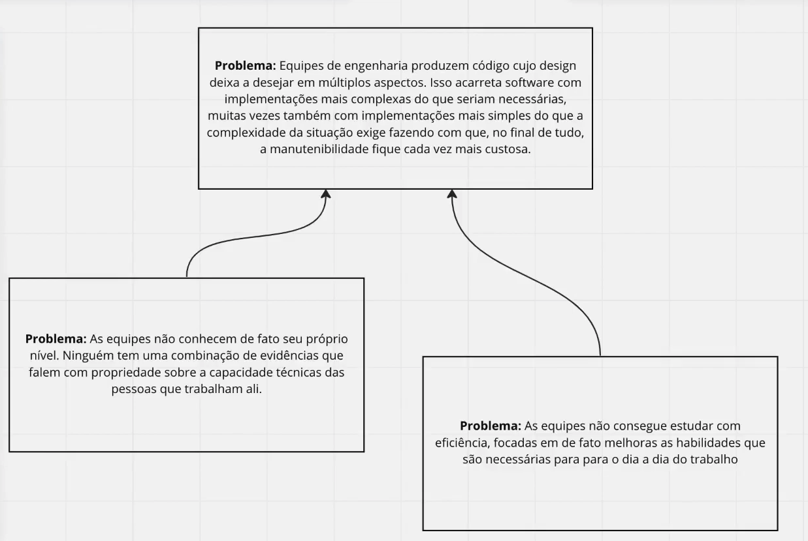

# DDD

**30-05-25**

## Aprofundamento no dominio

Entender o domínio o negocio é fundamental, quem são os stakeholders, por que esse serviço é necessário, qual o papel de cada um, qual é a importancia do serviço, quais são os requisitos funcionais e não funcionais, etc.

explicar a como o negocio funcionar, e tentar validar.

## Especialista de domínio

É o especialista do domínio ou negocio, essa pessoa pode varia, em alguns casos vai ser o product owner ou product manager. No mundo ideal implementação é negocio devem está proximos, de forma geral o desenvolvedor deve saber o maximo possível sobre o domínio do negócio.

## Linguagem ubíqua

Linguagem comum do negocio, elé da exemplo de task class, learn task, pois para o contexto é muito importante. Construi a linguagem ubíqua é um processo continuo que vai ser necessário feedback e discovery.

Saber bem todos os conceito no código devem ser claros para todos os membros da equipe.

## portugues e inglês

O importante é manter o vocabulário comun, se ó codigo estiver em inglês, então nesse caso devemos ter uma tradução comum em português, e vice-versa. O importante é manter a consistência e clareza no código.

pre-fixo e sufixo seriam mantidos : `get`, `set`, `is`, `has`, `to`, `from`, `create`, `update`, `delete`, etc.

## Contexto delimitados

Bound context, "contexto delimitado pelo problema"

### Problema sub problemas core

entender o problema e dividir em sub problemas, cada sub problema deve ser um contexto delimitado, onde o modelo de dominio é aplicado.

é preciso encontrar o especialistar para entender os sub problemas.

coesão é palavra chave, se o sub problema se conecta com o problema principal.

### Software emerge
