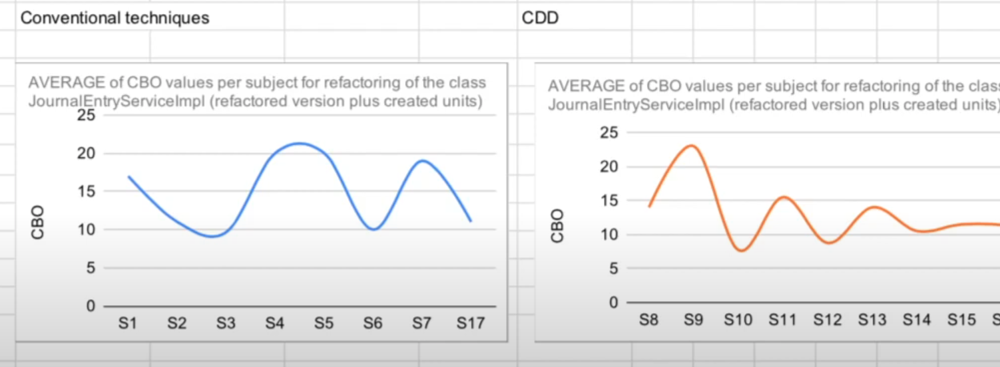
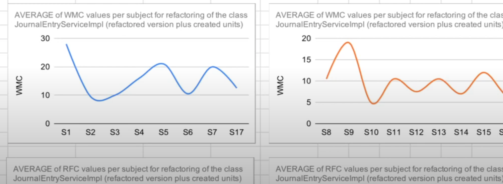
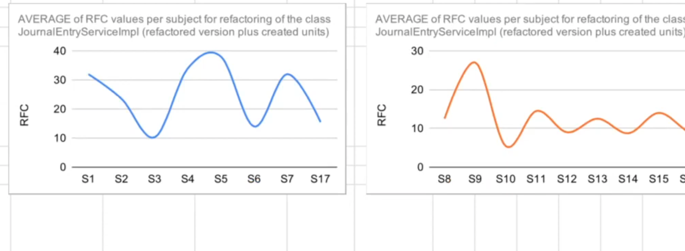
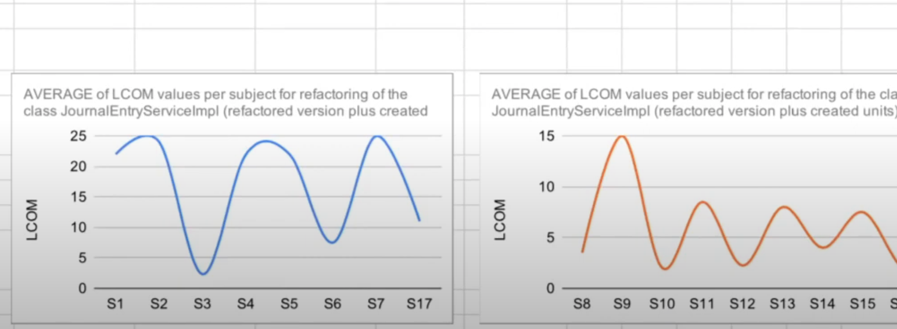
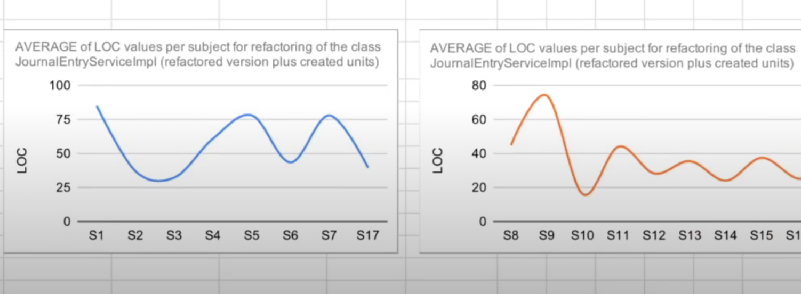

# Introdução Cognitive Driven Development (CDD)

**03/05/2025**

## Aula 01

**Introdução ao Cognitive Driven Development (CDD)**

## Aula 02 - mostrando feing falando sobre controlar complexidade

exemplo utilizando a biblioteca feing, a classe usada no exemplo é a RequestTemplate

## Aula 03 -  complexity tracker para demonstrar aumento complexidade

tem um projeto no git hub no alberto  [complexity tracker](https://github.com/asouza/complexity-tracker)

LCOM - falta de coesão

WMC - complexidade ciclomática

CBO - acoplamento entre classes

Olhar no futuro um estudo sobre metricas de complexidade de código.

## Aula 04 -  Explicando o experimento com CDD

um experimento realizado na empresa zup, uma metada fez a refotoração do código usando tecnicas tradicionais, e outra metade fez a refotoração usando uma metrica derivada do CDD.

Utilizando a classe JournalEntryServiceImpl.java

### metricas convencionais

- CBO
- WMC
- RFC
- LCOM
- LOC

#### CBO

no CBO o resultado foi bem similar

#### WMC (complexidade ciclomática)

o Cdd foi melhor e a variação foi menor.

#### RFC (numero de metodos publicos)
o cdd foi melhor e variação também foi menor.

#### LCOM (falta de coesão)

o CDD foi melhor e a variação foi menor.

#### LOC (linhas de código)

os resultados do CDD foram bem promissores.

## Aula 05 -  Exemplo ratico metirca alberto derivada do CDD

CDD é pratica que promover o entedimento do código.

sempre tentar identificar niveis de complexidade.

As pessoas que são devs devem saber das tecnologias que são transversão.

### Metricas do Alberto

- 1 ponto para cada acoplamento com classe específicas do projeto qeu você encontrar
- 1 ponto para cada branch de código encontrada (if, else, ternario, loop, switch, case, try, catch)
- 1 ponto para função como argumento que você passar(ex: filter, map, reduce, Consume)

### criterio para pontuação
- classes que possuem atributos de dependencia - limite máximo de 7 pontos
- Classe que possuem atributos de estado - limite máximo de 9 pontos

## Aula 06 - derivando para n cenarios

### Metricas para padrão de industria

supondo que as dependencias contam como pontos

1. ponto - qualquer acoplamento
2. ponto - para branch
3. ponto - para função como argumento

#### criterio para pontuação
- classes que possuem atributos de dependencia - limite máximo de 7 pontos
- Classe que possuem atributos de estado - limite máximo de 9 pontos

### Metricas para equipes trabalhando em frameorks ou bibliotecas

podemos dobrar os pontos no criterio de pontuação, pois podemos asumir que os devem possuir uma senioridade maior.

- 1 ponto para cada acoplamento com classe específicas do projeto qeu você encontrar
- 1 ponto para cada branch de código encontrada (if, else, ternario, loop, switch, case, try, catch)
- 1 ponto para função como argumento que você passar(ex: filter, map, reduce, Consume)

#### criterio para pontuação
- classes que possuem atributos de dependencia - limite máximo de 14 pontos
- Classe que possuem atributos de estado - limite máximo de 18 pontos

## Aula 07 -  aplicando para cenarios de código lagado

quando o código é legado, o Alberto sugere porcentagens de melhorias de pontos, 100, 90,80, 70, 60, 50, 40, 30, 20, 9

a cada mudança que você faz, você deve aplicar a porcentagem de melhoria.

## Aula 08 - design escalve sustentavel

uma forma de controlar a complexidade do código no medio e longo prazo, é usar o CDD para controlar a complexidade do código.

## Aula 09 -  relação com outras tecnicas praticas

## Aula 10 - dinamica derivação metrica cdd

## Aula 12 - design acomoda mudança pessoas escopo vs design acomada mudança tecnologia

O design do código deve acomodar mudanças de pessoas e escopo, e não mudanças de tecnologia.

A não ser que a mudança de tecnologia seja uma mudança de escopo.

