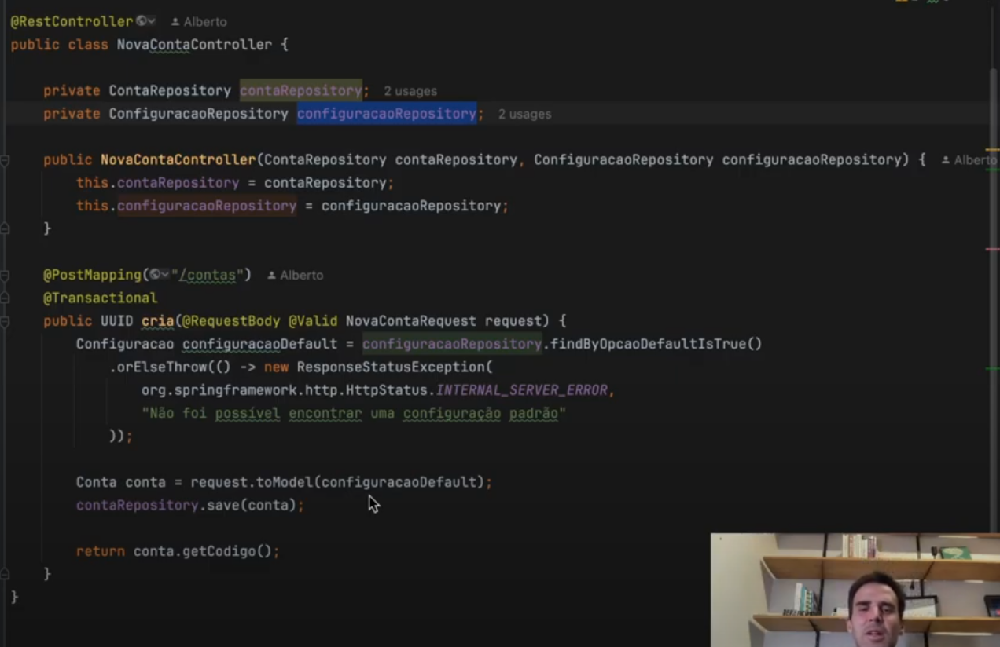

# Designer de código

## Aula 19 - teste com real qualidade

teste melhoram a confiabilidade de código. geralmente quando temos uma corbetura de testes alta, temos uma geração grande de código.

a relação custo beneficio é muito boa, pois o custo de manutenção é menor.

o melhor teste é que simular o código em produção.

teste de integração, são muito bons para simular o código em produção. Mas o custo de manutenção é tempo de execução é elevado.

quando vamos implementar código temos "um desejo é uma certesa", o desejo é que o código funcione, e a certeza é que vai haver bugs.

## Aula 20 - guideline é importante

Construir guilines, construir um direcionamento nitido para o time, trabalhar no reviwer de código. guide lines é processo de construção de código, que melhoram e padronizam o código.

criar guidelines tornam claro quais os padrões de desenvolvimento.


### Aula 21 - metrica cdd  - guideline

você deve pensar e avaliar como uma equipe, para chegar a um consenso.

### aula 22 - testes automatizados - guidelines

### Aula 23 - log sistematico - guidelines

tecnicas do s 6w(who, what, when, where, why, how) para criar logs sistematicos.

observabilidade e monitoramento.

### Aula 24 - maximize a coesão

reflitar sobre a coesão.

### Aula 25 - postergue generalização

esperar o maximo para generalizar, deixa a ideia maturar e ficar mais claro.

### Aula 26 - 6 controllers 100 coesos

controller 100% coeso, considerar isolar as funcionalidades em fluxo de execução. fazer as classe mais coesas possiveis.

atributo de valor e atributo de dependencia.

atributo de valor é o que a classe tem, e o atributo de dependencia é o que a classe precisa como os repositórios do spring data.

### Aula 27 - value object

Se um objeto eu posso ter metodos, dtos não precisam ser somente atributos, eles podem ter metodos auxiliares, como mappers geralmente com o toModel, toEntity, toDto.




### Guideline de qualidade de código


```markdown
## Métrica e avaliação de complexidade de código guiada CDD
### Metrica

1. condinal(if, loops, ternario) - 1 ICP(intrinsic complex point)
2. bloco de código (try, catch, cases do switch, funções como argumentos) - 1 ICP
3. Acoplamento com classe especificas do projeto - 1 ICP

### Como vamos avaliar o que foi medido ?

- Se é greenfield(começo de projeto), sugiro começar de maneira mais restritiva e avaliar. Limite de ICPS por arquivo é 10.
- Se é um legado de conhecimento que já vem com bastante complexidade, aumenta esse limite. limite inicial 50.

## Guia para escrita de teste automatizado

1. Busque sempre 90% ou mais cobertura.
2. Busque escrever os testes mais integrados possíveis.
3. Fique sempre atento a velocidade de execução.
4. Pra cobrir o código, utilize a técnica MC/DC.
5. Utilize a técnica de Boundary Testing para explorar os valores de teste.
6. Utilize property based testing para ir lém dos testes derivados de maneira sistemática.
7. Defina uma métrica e uma forma de avaliar insperiada no CDD para controlar o aumento de complexidade dos arquivos de teste.

## Guiar para Logar

### Quando logar e qual nível de severidade usar

1. Sempre que tiver alteração de estado no sistema, realize o log em nível de info antes e depois da alteração.
2. Sempre que for consumir serviços externos, realize o log em nível de info antes e depois da chamada api.
3. Sempre que você realizar um tratamento de error, cujo o problema permite que o fluxo da aplicação continue, realiaze o log em nivel de error. Lembrando de evita logar em niível de erro e relança o problema para cima.
4. Realize log em nivel de debug quando o código tiver caminho de decisão, como ifs e loops. Faça isso com parcimônia.

### Como logar

Todas as aplicações devem realizar o log utilizando a biblioteca padrão da empresa que já obriga a passagem de parametros importantes.

## Maximize a coesão do código

Constantemente analise se o código está escrevendo tem conexão com os outro s códigos já escritos. tente manter junto o que faz sentido ficar junto, relamente proximo. Alguns exemplos da aplciação dessa ideia.

1. Se vocẽ tem uma classe qeu tem um atributo de data e você precisa saber se determando objeto tem um valor antes ou depois daquela data, você deveria criar um métod dentro dquela classe para operar sobre o atributo.

## Postergue ao maximo generalização e ideias de reuso de código

Decidir precocemente sobre generalizações e códigos reutilizaveis, pode fazer com que você extraia algo que não é de fato reaproveitavl. Simplemente pelo fato de você não ter esperado coletar mais variáveis de entendimento sobre o problema que estava sendo resolvido.

## Patterns que podem ser seguidos

1. Controller 100% coeso.
2. Services 100% coeso.
3.  form/request/DTO value object

```


