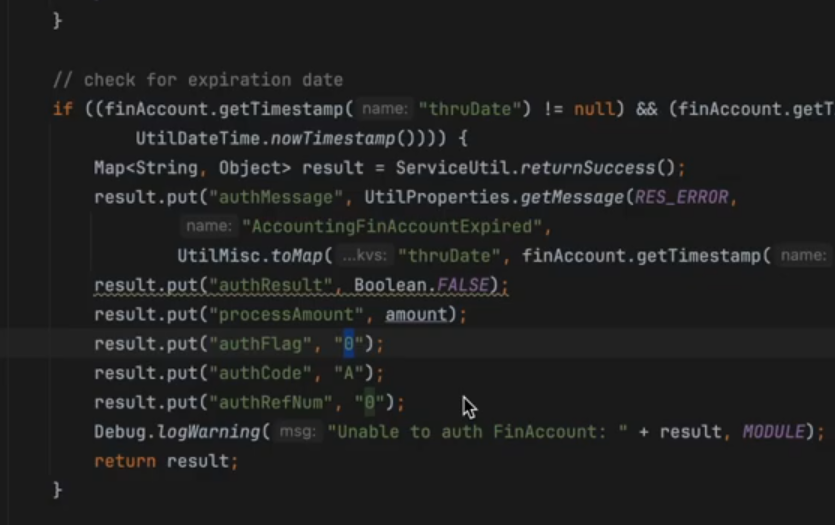

# Qualidade software

## Aula 02 - qualidade eh maior que seguir as praticas em si


se o código que estou fazendo faz o que devia, e o código que estou fazendo consegue ser mantido.


## Aula 03 - seja realmente critico

Siga qual quer principio que faça sentido para sue equipe, fique sempre fique no estado de criticidade.


## Aula 04 - tempo qualidade de código

- A fluidez ao executar uma tarefa impacta no tempo de execução da tarefa.
- Quanto de fluidez você tem na IDE
- Fluidez dependencias do projeto(spring, hibernate, camel para integração), entender o que de fato precisar escrever, usar ao maximo os recuros das bibliotecas.
- Pre-work, uma analise do problema antes de iniciar o trabalho

se não melhorar nos pontos acima, o tempo começa a não ter tanto impacto.

## Aula 05 - Fluidez utilização dos conceitos

código do [ofbiz](https://github.com/apache/ofbiz-framework)

é um projeto que tentar trazer tudo com valores "genericos", ele utilizar os valores como Map.

no caso abaixo poderiamos fazer um builder para inicializar o objeto, ao inves de usar o Map




## Aula 06 - Conheça as tecnologias do projeto

hibernate validator

o Hibernate validator não é permitido utilizar o construtor com parametro,ele obrigar a passar os parametros para o metodo initializer.

No entento, No spring-boot na dependencia Spring-validator, o construtor com parametro é permitido.

nesse caso fica bem nitido que a fluidez do spring-boot melhorar o código, pois não precisamos, implementar o construtor com os parametros, e sim o metodo initializer.

Essa constraint funcionar apenas no contexto do spring, se você usar na entidade não vai funcionar por que o hibernate espera um construtor sem parametro.

se você criar um contrutor sem parametro, no momento da validação do controlador, o contrutor sem parametro vai ser chamado e você não vai ter a injeção da dependência.

você pode tratar para quando não houver o contexto do spring não executar o código, ou gerar um erro para evitar usar fora do contexto do spring.

``` java
// 2. Implementando o validador com injeção por construtor
package com.exemplo.validation;

import javax.persistence.EntityManager;
import javax.persistence.PersistenceContext;
import javax.validation.ConstraintValidator;
import javax.validation.ConstraintValidatorContext;

import org.springframework.stereotype.Component;

public class UniqueValueValidator implements ConstraintValidator<UniqueValue, Object> {

    private final EntityManager entityManager;

    private String fieldName;
    private Class<?> domainClass;

    // Injeção de dependência pelo construtor
    public UniqueValueValidator(EntityManager entityManager) {
        this.entityManager = entityManager;
    }

    @Override
    public void initialize(UniqueValue constraintAnnotation) {
        this.fieldName = constraintAnnotation.fieldName();
        this.domainClass = constraintAnnotation.domainClass();
    }

    @Override
    public boolean isValid(Object value, ConstraintValidatorContext context) {
        // Caso o valor seja nulo, não aplicamos a validação
        if (value == null) {
            return true;
        }

        // Criando a query JPQL para verificar se já existe um registro com o valor
        String jpqlQuery = String.format("SELECT COUNT(e) > 0 FROM %s e WHERE e.%s = :value",
                                        domainClass.getSimpleName(), fieldName);

        Boolean exists = entityManager.createQuery(jpqlQuery, Boolean.class)
                                     .setParameter("value", value)
                                     .getSingleResult();

        return !exists;
    }
}
```

## Aula 07 - domine sua IDE


Fazer a jornada para dominar a IDE, intellij


## Aula 08 - Requisitos ponto vista negocio

melhorar no pre-work, pelo vies do negocio, triturar o requisito, trabalhar de modo sistematica desda da concepção, o principal motivo é ter um entendimento do código reduzindo custos. Devemos sempre ser críticos, é importante fazer um double check com a pessoal que escreveu o requisito ou com gerador do requisito(stakerholder).


## Aula 09 - Requisitos ponto pessoa programadora

### Eficiência

- cada vez mais rapido
- com a mesma qualidade ou melhor
- com menos gastos energitico

Antes de começar a implementa é importante fazer um pre-work, fazer um checklist, em um formato para desenvolvimento, que vai ser um passo a passo pensando em código mesmo.


## Aula 10 - Importancia de Entender o negocio

ter a aproximção com o negocio, te ajudar a entender como o código e escrito, o vocabulário é importante, os nomes de pacotes, classes, métodos, variaveis, etc. O nome é o primeiro passo para entender o código.

Entender o negocio te ajudar a entender o contexto do código, e te faz ter criticidade, sobre como a feature pode ser melhorada.

criar um plano de apriendizagem do dominio do negocio, gerar muito valor para desenvolvimento.


