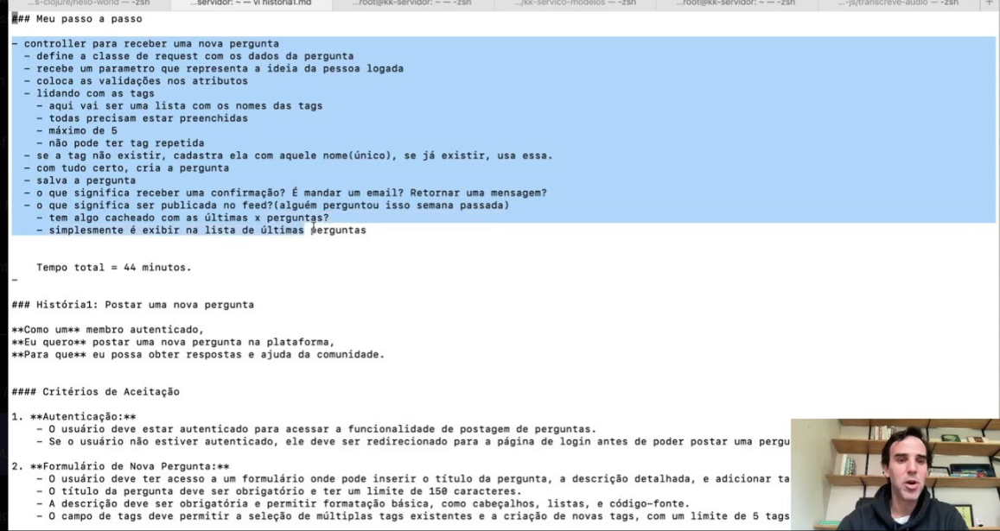

# Mecanismos

Pensar em um caminho aonde podemos minimizar imprevistos

## aula-07

[Shape up](https://basecamp.com/shapeup) , uma livro criado pela basecamp. Cobre aspactos do fluxo de desenvolvimento de software.

1. shaping é processo de refinamento de requisitos.
2. Betting é etapa de validação e "aposta".
3. building construção

## Aula 08  Requisitos funcionais e não funcionais

Software Engineering 9th edtion Sommerviller

Um requisito funcional é algo que tem um input e gerar output, ou seja, uma funcionalidade.

Requistos não funcionais - "constraints", tempo de resposta, disponibilidade, resiliência, escalabilidade.

## Aula 09 - busque acesso a quem idealizou o requisito

passo 1

- Conversar com a pessoal que pensou no requisito, stakeholder
- A fonte de maior confiabilidade de um requisito é a pessoa que idealizou o requisito.

## Aula 10 - artefatos de requisitos

passo 2

ler o documento de requisitos, apos isso, proucurar a pessoal que idealizou, caso não seja possivel, procurar a pessoa que fez o documento de requisitos.

Analise de causa raiz 5 porques, questionar 5 vezes o porque, para tentar chegar na causa raiz do problema.

criar um artefato de requisitos, um documento que descreve o que deve ser feito, baseado no seu entendimento.

** Nunca códifique sem ter certeza do que deve ser feito, isso pode gerar retrabalho. **

## Aula 11 - double check - passo 3

passo 3 - 1

Apredizagem negativa, quando você aprendeu, mas aprendeu errado. o Feedback é importante para evitar isso.

fazer um conversa com quem idealizou o requisito, validando o que você entendeu. confirmando com o que você entendeu. está deacordo com o que foi idealizado.

se você não tem como conversar com a pessoa que idealizou o requisito, você precisar ter conciencia do risco que você está correndo.

## Aula 12 - materializando o entendimento - passo 3

passo 3 - 2

expirado no shape up, no capitulo find the elements

fazer atos de reflexão, para melhorar o entendimento do que deve ser feito. quanto maior o entendimento, maior vai ser a autopercepção do que deve ser feito.

Entedimento de mais auto nivel

### Breadboarding -

é um fluxo somente escrevendo, criar um fluxo super simples, que simbolizar o caminho do requisitos.

### fat marker sketch

lista de todos, e agrupar os todos, fazer um desenho `tosco`

## Aula 13 - teste de cenarios - passo 4

podemos utilizar teste de cenarios com cucumber, utilizar ia generativa para ter uma base, a ideia é refletir, utilizar a ia para ter um ponto de partida, não como ponto de chegada.

gerar valor com o minito de trabalho possivel.

teste end to end.

## Aula 14 - descrevendo a implementação - passo 5

"se você não for capaz de imaginar, como você vai ser capaz de implementar".

o passo a passo deve está bem claro, para não gerar duvidas.

1. Meu passo a passo (passo a passo detelhado tecnicamente)
2. Histórias (como um, eu quero, para que)
3. Critérios de Aceitação

## Aula 15 - criando um template de requisitos

template de requisitos [template](template-requisito.md), template criado pelo chatgpt,

## Aula 16 - Como posso exercitar

