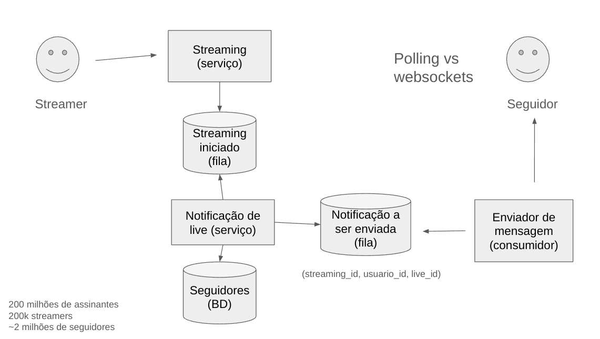

# System Design Interview

Mauricio Aniche

> Foque sempre na jornada na criação do diagrama.
> Tente sempre usar filas para desacoplar os serviços e processamentos assíncronos.

---

## Encurtador de URL

Um encurtador de URL é basicamente um serviço de chave-valor (token → URL) com redirecionamento HTTP, usado para tornar links longos mais curtos e rastreáveis.

### Como abordar o problema

1. **Faça perguntas**
   - Quantas URLs serão encurtadas por mês? (50 milhões é um bom chute)
   - Não tenha medo de fazer perguntas para entender o problema.
   - Geralmente, faça duas ou três perguntas iniciais.
2. **Desenhe o diagrama**
   - Tente criar o diagrama e, durante o processo, continue fazendo perguntas.
3. **Entenda os principais componentes do sistema**
4. **Mapeie os dados**
   - No caso do banco de dados, represente por chave e valor.
5. **Adicione o máximo de informações possíveis**
   - Como a quantidade de registros.
6. **Pense nas possibilidades de execução e deixe claros os trade-offs**

#### Pontos importantes

- Utilizar um counter distribuído (ex: Redis) para gerar tokens.
- Calcular a quantidade de leituras por segundo.
- O serviço de leitura deve escalar horizontalmente.
- Utilizar um Load Balancer.
- Criar um componente responsável por fazer o lock do counter.
- Calcular o tamanho dos registros no banco de dados e decidir por um banco não relacional.
- Implementar rate limiting nas APIs pensando em segurança.
- Transformar o Load Balancer em uma API Gateway para aplicar o rate limiting.

---

## Sistema de Cardápio

### Como abordar o problema

1. **Faça perguntas**
   - Qual a quantidade de pessoas em horários de pico?
   - Existe a possibilidade de alterar o cardápio durante o almoço ou há um bloqueio?
2. **Deixe claro que fará perguntas ao longo do tempo**
3. **Utilize ferramentas para diagramas**
   - Exemplo: Google Slides

#### Pontos importantes

- Sempre descreva os números relevantes.
- Utilize cache em memória (regra 80/20).
- Calcule junto com o entrevistador o tamanho do cache.
- Use banco de dados com várias réplicas de leitura.
- Considere usar banco de dados replicado ao invés de cache, utilizando Load Balancer.
- Defina períodos de freeze (não alterar o cardápio antes do pico).
- Utilize banco NoSQL, como DynamoDB.
- Discuta estratégias de sharding, mesmo que não utilize.
- Separe o serviço de pedidos.
- Use uma fila para escalar o serviço de pedidos.
- Considere um sistema de notificações.

---

## Notificação de Streamer: Filas, Polling vs Websockets e Banco de Dados

### Como abordar o problema

1. **Faça perguntas**
   - Qual a quantidade de streamers?
   - Qual a quantidade de usuários?
   - Qual o requisito de tempo para a notificação?
2. **Desenhe o diagrama**
   - Utilize ferramentas como Google Slides ou Draw.io.

#### Pontos importantes

- Considere que o serviço de streaming já existe.
- O serviço de streaming publica em uma fila.
- Um serviço de notificação consome essa fila e envia notificações para os usuários, utilizando um banco de dados de seguidores.
- O serviço de notificação publica na fila de notificações.
- Criar um consumidor que envia notificações para os usuários.
- Considere duas opções de notificação: polling e websockets.
  - **Polling**: simples de implementar, mas consome mais recursos do celular, pois a aplicação faz requisições constantes ao servidor.
  - **Websockets**: também consome recursos do celular, pois a conexão fica aberta o tempo todo.

#### Requisito funcional de agendamento

- Podemos ter um requisito não funcional que exige que o streamer agende previamente quando vai iniciar a transmissão.
- Resolve o problema da notificação, pois agora o cliente já sabe que o stream vai começar.
- O cliente, periodicamente, sincroniza para saber se foi adicionada uma nova transmissão à agenda.

**Solução com polling vs websockets:**

**Solução com o requisito funcional de agendamento:**

---

## Estorno Bancário: Filas, Consumidores e Idempotência

### Informações adicionais

- A Visa tem uma API que aceita estornos somente em dois horários específicos.

### Como abordar o problema

1. **Faça perguntas**
   - O que acontece se eu perder a janela de estorno? (pode ser utilizada na próxima janela)
   - 100 milhões de clientes com 20 mil estornos diários.
2. Seja claro que você vai fazer perguntas ao longo do tempo.
3. **Desenhe o diagrama**
4. **Pergunte ao entrevistador:** "Tem algum tipo de confirmação manual?" (Sim, o estorno precisa ser confirmado manualmente)
5. **Pergunte ao entrevistador:** "O cartão de crédito tem um mecanismo para evitar duplo processamento?" (Sim, quando você cria o arquivo CSV com o estorno, existe uma chave de idempotência que é única)
6. **Pergunte ao entrevistador:** "O que acontece se o serviço de processador de estorno falhar?" (Os dados não serão perdidos, pois estarão na fila. Se reiniciar o serviço, ele vai consumir os dados da fila e processar o estorno)
7. **Pergunte ao entrevistador:** "O que acontece se o serviço de cartão de crédito falhar?" (Nesse caso, poderíamos ter uma política de retry. Como garantimos a idempotência, podemos tentar novamente o estorno na próxima janela ou, se houver tempo, fazer uma nova tentativa com backoff exponencial)

#### Pontos importantes

- Utilize filas para criar um sistema de consumidores, permitindo que múltiplos serviços utilizem a informação do estorno.
- Crie um banco de dados para requisição de estorno do cliente.
- Serviço separado para confirmação manual do estorno (suporte).
- Se confirmado o estorno, utilizar uma fila de estorno requisitado (suporte).
- Um consumidor é um serviço que consome os estornos.
- Não queremos enviar elementos duplicados para o serviço de cartão de crédito; nesse caso, a aplicação de processamento salva o estorno no banco de dados com idempotência.
- Um serviço de processamento de estorno tem um banco próprio.
- Fila de estornos concluídos para notificar o cliente.
- Aplicação consumidora altera o estado do estorno no banco de dados.

## Dicas finais

- A jornada é muito mais importante do que o resultado final.
- Não começe a desenha o diagrama logo
- começe com as peguntas
- repetir as deciçoes tomadas, faça resumos
- lembre de descurtir escalabilidade (filas, cache), segurança (rate limiting, autenticação), privacidade (criptografia, anonimização de dados)
- Trade-offs de cada decisão
  - pensar no ponto de vista de resiliência(o que acontece se um serviço falhar?)
- principais soluções de escalabilidade horizontal
  - serviços pequenos e separados
  - utilizar filas para desacoplar serviços
  - cache (cache hit ou cache miss)
  - utilizar banco de dados não relacional
  - utilizar sharding
  - utilizar load balancer
  - utilizar API Gateway
  - rate limiting
  - micronserviços independentes(fica mais facil de escalar)
