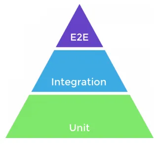

**26-05-25**

# Testes jutando academia industria

livro aberto escrito por Mauricio,

o teste tem a intenção de validar o padrão mais utilizado no mercado.

a academia tenta geralmente fazer o teste para encontrar erros.

referência:

[effective software testing: a developer's guide](https://www.amazon.com.br/Effective-Software-Testing-developers-English-ebook/dp/B09WBNJYLX)


# Testes mitos fatos como vamos seguir com testes

teste como revelador de bugs, cobertura de código, baseado em 90% existem alguns artigos que dão uma boa garantia de que o código está correto.

**O conjunto de tecnicas fala muito sobre a qualidade de testes.**

Fazer os testes antes de começar a códificar pode ser um bom vetor para planejamento.

# Foco em testes unidade

na **teste de unidades** jornada vai ser um ponto de entrada de dados.

teste de sistema, ou teste de caixa preta, é um teste que não se preocupa com a implementação, mas sim com o resultado final. faz um input e espera um output.

teste de integração, é um teste que verifica se os componentes do sistema estão funcionando juntos corretamente. por exemplo testar uma query do banco de dados.

teste de uso, é um teste que verifica se o sistema está funcionando como esperado pelo usuário. por exemplo, testar se o botão de login está funcionando corretamente.



# Specification based testing

Utilizando apenas a especificação podemos criar os casos de testes.


## Exemplo

### Necessidades

Dadoo id de um restaurante e o id do usuario, precisamos retornar as formas de pagamento que o usuário em questão aceita e que também são permitidas pelo restaurante.

O retorno esperado é o seguinte:

- descrição da forma de pagamento
- id da forma de pagamento

### Restrições

- id do restaurante é obrigatório
- id do usuário é obrigatório

### Resultado esperado

- formas de pagamentos disponiveis

### Testes baseado na especificação (visa, master, elo, maquina de cartão, dinheiro, paypal)


- id usuario, id restaurante
- Usuario, Restaurante
-
#### Cobinação
  - usuario visa, master e restaurante visa, master
  - usuario visa, master e restaurante aceita visa
  - usuario visa, master e restaurante aceita elo


### Classes de equivalência

é tentar buscar os valores que gerem equivalencias


## Exemplo Claudia IA

### Resumo: Criação de Testes Specification-Based

#### 1. Analise a Especificação
- Leia o requisito e identifique **entradas**, **saídas** e **regras de negócio**
- Anote todas as condições e restrições

#### 2. Aplique Particionamento de Equivalência
- **Partições válidas**: valores aceitos pelo sistema
- **Partições inválidas**: valores rejeitados pelo sistema

**Exemplo:**
```
Função: validarIdade(idade)
- Válida: [0-120]
- Inválida: [-∞,-1], [121,+∞]
```

#### 3. Teste Valores Limite
Para cada partição, teste:
- **Valor mínimo** da partição
- **Valor máximo** da partição
- **Valores fora** dos limites

**Exemplo:**
```
Para partição [18-65]:
Testes: 17, 18, 19, 64, 65, 66
```

#### 4. Crie Casos de Combinação
Use **tabela de decisão** para combinar múltiplas condições:

```
| Idade >= 18 | Renda >= 1000 | Resultado |
|-------------|---------------|-----------|
| Sim         | Sim           | Aprovado  |
| Sim         | Não           | Pendente  |
| Não         | Sim/Não       | Rejeitado |
```

#### 5. Teste Casos Especiais
- **Valores nulos**: `null`, `undefined`
- **Valores vazios**: `""`, `[]`
- **Valores extremos**: muito grandes/pequenos

#### 6. Documente Cada Teste

**Template:**
```
ID: TC001
Entrada: idade = 17
Resultado Esperado: "Idade inválida"
Técnica: Valor limite (partição inválida)
```

#### 7. Organize por Prioridade
1. **Casos válidos** (happy path)
2. **Casos limite** (boundaries)
3. **Casos inválidos** (error scenarios)
4. **Combinações complexas**

---

#### Fórmula Rápida
1. **Identifique** entradas e regras
2. **Divida** em partições válidas/inválidas
3. **Teste** limites de cada partição
4. **Combine** múltiplas condições
5. **Adicione** casos especiais (null, vazio, extremos)
6. **Documente** cada caso com entrada e resultado esperado


# Boundary test

as partições são os fluxos que que o sistema pode seguir.

no exemplo aonde a gente tem um validador de idade, podemos ter as seguintes partições:

greaterThan = 18

## particições
in point = 18 (verificação de idade válida)
off point = 17 (verificação de idade inválida)

## Teste

O Junit tem uma anotação chamada @ParamenterizedTest, aonde podemos usar uma nova anotação chamada @CsvSource,

``` java
@DisplayName("Teste de idade")
@ParameterizedTest
@CsvSource({
	"17, false", // idade inválida
	"18, true",  // idade válida
	"19, true",  // idade válida
	"120, true", // idade máxima válida
	"121, false" // idade acima do limite
})
void testIdade(int idade, boolean esperado) {

	//Chamado do método que valida a idade


}
```


## Exemplo Claudia IA

### Resumo: Boundary Testing (Teste de Limites)

#### 1. Identifique os Limites
- Encontre **intervalos** e **faixas** na especificação
- Identifique **valores mínimos** e **máximos** aceitos
- Localize **pontos de transição** entre comportamentos

**Exemplo:**
```
Desconto por idade: 18-25 anos = 10%, 26-60 anos = 5%
Limites: 18, 25, 26, 60
```

#### 2. Aplique a Regra dos 3 Pontos
Para cada limite, teste **3 valores**:
- **Valor anterior** ao limite (fora da faixa)
- **Valor exato** do limite (no limite)
- **Valor posterior** ao limite (dentro da faixa)

**Exemplo:**
```
Limite: idade >= 18
Testes: 17, 18, 19
```

#### 3. Teste Limites Internos e Externos
- **Limite interno**: primeiro valor válido da faixa
- **Limite externo**: último valor válido da faixa

**Exemplo:**
```
Faixa: [10-50]
Limite interno: 9, 10, 11
Limite externo: 49, 50, 51
```

#### 4. Casos Especiais de Limite

#### Valores Extremos do Sistema
- **Valor mínimo** do tipo de dados
- **Valor máximo** do tipo de dados

**Exemplo:**
```
int: -2.147.483.648, 2.147.483.647
string: "", "texto muito longo..."
```

#### Limites de Coleções
- **Tamanho 0** (vazio)
- **Tamanho 1** (único elemento)
- **Tamanho máximo** permitido

**Exemplo:**
```
Lista de itens (max 100):
Testes: 0 itens, 1 item, 99 itens, 100 itens, 101 itens
```

#### 5. Padrões de Teste por Tipo

##### Números Inteiros
```
Faixa: [5-10]
Testes: 4, 5, 6, 9, 10, 11
```

##### Números Decimais
```
Faixa: [1.0-5.0]
Testes: 0.99, 1.0, 1.01, 4.99, 5.0, 5.01
```

##### Strings
```
Tamanho: [3-10] caracteres
Testes: "ab", "abc", "abcd", "123456789", "1234567890", "12345678901"
```

##### Datas
```
Período: 01/01/2024 - 31/12/2024
Testes: 31/12/2023, 01/01/2024, 02/01/2024, 30/12/2024, 31/12/2024, 01/01/2025
```

#### 6. Documente os Testes

**Template:**
```
ID: BT001
Tipo: Boundary Test
Limite Testado: idade >= 18
Entrada: idade = 17
Resultado Esperado: "Idade insuficiente"
Categoria: Valor abaixo do limite
```

#### 7. Organize por Criticidade
1. **Limites de segurança** (autenticação, autorização)
2. **Limites de negócio** (preços, quantidades)
3. **Limites técnicos** (capacidade, performance)
4. **Limites de interface** (campos, formulários)

---

#### Fórmula Rápida para Boundary Testing

1. **Encontre** todos os limites na especificação
2. **Aplique regra dos 3**: valor anterior, exato, posterior
3. **Teste limites internos** (início da faixa) e **externos** (fim da faixa)
4. **Adicione extremos** do sistema (min/max do tipo de dados)
5. **Considere coleções**: vazio, 1 elemento, máximo permitido
6. **Documente** cada teste com o limite sendo testado

#### Checklist Rápido
- [ ] Todos os intervalos numéricos testados
- [ ] Limites de strings (tamanho mín/máx)
- [ ] Limites de coleções (0, 1, máximo)
- [ ] Extremos de tipos de dados
- [ ] Limites de datas/períodos
- [ ] Transições entre estados/comportamentos

# Structural testing

Baseado geralmente em cobertura de código. é o padrão mais utilizado no mercado.


