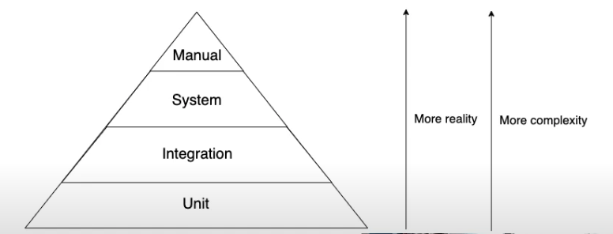

**26-05-25**


# Teste de unidade

- rapido de executar
- maior volume de testes

## Desvantagens

- ficar mais distante da integração do sistema

# Teste integrado

- mais proximo do sistema
- representa mais proximidade com o usuário final


## Desvantagens
- maior numero de dependências
- mais lento de executar
- setup e teardown mais complexo


# Teste de sistema

- teste do usuario final, "chamar a api"





# Tente fazer teste de unidade integrado

Sempre que possivel, sempre tente criar os objetos que você precisa, tente realizar o mock de integrações como banco de dados ou serviços externos.


``` java

@Test
void testeDeUnidade() {
	// Criação do objeto a ser testado
	MeuObjeto objeto = new MeuObjeto();

	// Configuração do mock para dependências externas
	DependenciaExterna mockDependencia = Mockito.mock(DependenciaExterna.class);
	objeto.setDependencia(mockDependencia);

	// Execução do método a ser testado
	Resultado resultado = objeto.metodoAserTestado();

	// Verificação do resultado esperado
	assertEquals("Resultado esperado", resultado.getValor());
}

```

# Mocks em Java com Mockito

Os mocks são uma ferramenta fundamental para testes unitários, especialmente quando se trata de isolar componentes e testar suas interações com dependências externas. Em Java, o framework Mockito é amplamente utilizado para criar e gerenciar mocks de forma eficiente.

## Quando Usar Mocks

Mocks são especialmente valiosos para simular componentes externos como APIs REST, bancos de dados, serviços de terceiros ou qualquer dependência que você não deseja executar durante os testes. Quanto mais integrado for o componente mockado ao seu sistema, melhor será o isolamento e a confiabilidade dos seus testes.

## Cuidados com Matchers

Os matchers do Mockito como `anyString()`, `anyInt()`, `anyLong()`, `any()` são poderosos, mas devem ser usados com parcimônia. Alguns pontos importantes:

- **Especificidade**: Prefira valores específicos quando possível, pois tornam os testes mais claros e detectam melhor mudanças no comportamento
- **Consistência**: Se usar um matcher em um parâmetro, use matchers para todos os parâmetros do método
- **Legibilidade**: Matchers genéricos podem mascarar bugs e tornar testes menos expressivos

```java
// Evite quando possível
when(service.buscarUsuario(anyString())).thenReturn(usuario);

// Prefira
when(service.buscarUsuario("123")).thenReturn(usuario);
```

## Verificação de Não Execução

O `Mockito.never()` é uma ferramenta valiosa para garantir que determinados métodos não sejam chamados durante a execução do teste. Isso é especialmente útil para:

- Verificar que métodos custosos não são executados desnecessariamente
- Garantir que fluxos alternativos não executem código indevido
- Validar que otimizações estão funcionando corretamente

```java
// Verificando que um método nunca foi chamado
verify(emailService, never()).enviarEmail(any());

// Verificando que um método foi chamado exatamente uma vez
verify(logService, times(1)).logarEvento(anyString());
```

## Boas Práticas Adicionais

- **Injeção de dependências**: Utilize `@InjectMocks` para injetar automaticamente os mocks
- **Verificação rigorosa**: Considere usar `verifyNoMoreInteractions()` para garantir que apenas as interações esperadas ocorreram

# Testes api

# Testes de API com Spring Boot e Jqwik

## Introdução

Os testes de API são fundamentais para garantir a qualidade e confiabilidade de aplicações web modernas. A combinação das anotações `@AutoConfigureMockMvc`, `@JqwikSpringTest` e `@SpringBootTest` cria um ambiente de teste poderoso que permite criar testes de integração mais robustos e eficientes.

## Benefícios da Abordagem

### Testes de Integração Robustos
Esses testes permitem simular requisições HTTP reais e verificar as respostas do servidor, garantindo que a API funcione corretamente em diferentes cenários. Diferentemente dos testes unitários, os testes de integração validam o comportamento completo da aplicação, incluindo:

- Serialização/deserialização de dados
- Validações de entrada
- Processamento de regras de negócio
- Interação com banco de dados
- Tratamento de exceções
- Códigos de status HTTP corretos

### Property-Based Testing com Jqwik
O Jqwik introduz o conceito de property-based testing, gerando automaticamente centenas de casos de teste com dados variados, descobrindo edge cases que testes manuais poderiam não cobrir.

## Configuração das Anotações

### @SpringBootTest
Carrega o contexto completo da aplicação Spring Boot, incluindo todas as configurações, beans e componentes necessários para executar a aplicação em um ambiente de teste.

### @AutoConfigureMockMvc
Configura automaticamente o MockMvc, uma ferramenta que permite simular requisições HTTP sem iniciar um servidor web real, oferecendo melhor performance nos testes.

### @JqwikSpringTest
Integra o framework Jqwik com Spring Boot, permitindo usar property-based testing dentro do contexto Spring, combinando a geração automática de dados com a injeção de dependências.

## Exemplo Prático

```java
@SpringBootTest
@AutoConfigureMockMvc
@JqwikSpringTest
class UserApiTest {

    @Autowired
    private MockMvc mockMvc;

    @Autowired
    private ObjectMapper objectMapper;

    @Property
    void shouldCreateUserWithValidData(@ForAll @ValidUser User user) throws Exception {
        String userJson = objectMapper.writeValueAsString(user);

        mockMvc.perform(post("/api/users")
                .contentType(MediaType.APPLICATION_JSON)
                .content(userJson))
                .andExpect(status().isCreated())
                .andExpected(jsonPath("$.id").exists())
                .andExpected(jsonPath("$.email").value(user.getEmail()));
    }

    @Property
    void shouldRejectInvalidEmail(@ForAll @InvalidEmail String email) throws Exception {
        User user = new User("João", email, "senha123");
        String userJson = objectMapper.writeValueAsString(user);

        mockMvc.perform(post("/api/users")
                .contentType(MediaType.APPLICATION_JSON)
                .content(userJson))
                .andExpect(status().isBadRequest())
                .andExpected(jsonPath("$.errors").exists());
    }

    @Property
    void shouldReturnUserById(@ForAll @Range(min = 1, max = 1000) int userId) throws Exception {
        // Assume que o usuário existe no banco de dados de teste
        mockMvc.perform(get("/api/users/" + userId))
                .andExpect(status().isOk())
                .andExpected(jsonPath("$.id").value(userId))
                .andExpected(jsonPath("$.name").exists());
    }

    @Test
    void shouldReturn404ForNonExistentUser() throws Exception {
        mockMvc.perform(get("/api/users/99999"))
                .andExpect(status().isNotFound());
    }
}
```

