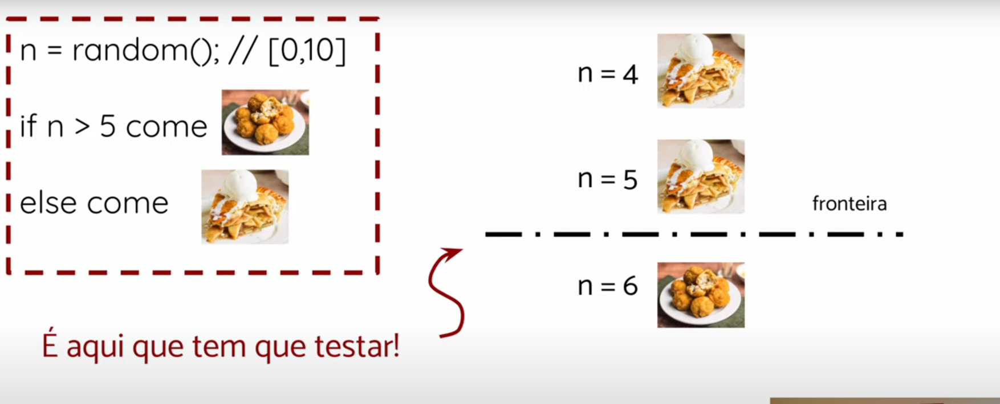

# Teste de Fronteiras

**Data:** 27-05-25

> **Conceito fundamental:** Os bugs geralmente ocorrem nas fronteiras, que são onde uma mudança de estado altera o fluxo de execução.



---

## 🎯 Definição de Fronteiras

Fronteiras são os pontos mais próximos de um estado de mudança, onde o comportamento do sistema pode alterar.

### Terminologia

| Termo | Definição | Característica |
|---|---|---|
| **On-points** | Valores que estão exatamente na fronteira da condição | Pontos onde a condição pode mudar de comportamento |
| **Off-points** | Valores imediatamente adjacentes aos on-points | Testam o comportamento do outro lado da fronteira |

---

## 📊 Exemplos Práticos

### Exemplo 1: Condição Maior Que
```java
valor > 100
```

| Tipo | Valor | Resultado da Condição | Explicação |
|---|---|---|---|
| **On-point** | `100` | ❌ Falsa | Fronteira exata da condição |
| **Off-point** | `101` | ✅ Verdadeira | Lado crítico da fronteira |

**Análise:** Para `valor > 100`, o on-point é 100 (fronteira) e o off-point 101 testa o lado onde a condição é verdadeira.

---

### Exemplo 2: Condição Maior ou Igual
```java
valor >= 100
```

| Tipo | Valor | Resultado da Condição | Explicação |
|---|---|---|---|
| **On-point** | `100` | ✅ Verdadeira | Fronteira exata da condição |
| **Off-point** | `99` | ❌ Falsa | Lado crítico da fronteira |

**Análise:** Para `>=`, o on-point 100 satisfaz a condição, e o off-point 99 testa o lado onde a condição falha.

---

### Exemplo 3: Condição de Igualdade
```java
valor == 100
```

| Tipo | Valores | Resultado da Condição |
|---|---|---|
| **On-point** | `100` | ✅ Verdadeira |
| **Off-points** | `101`, `99` | ❌ Falsa |

**Análise:** A igualdade tem dois off-points, testando ambos os lados da fronteira.

---

### Exemplo 4: Condição com Variável
```java
valor > n+1
```

| Tipo | Valor | Resultado da Condição | Explicação |
|---|---|---|---|
| **On-point** | `n+1` | ❌ Falsa | Fronteira exata da condição |
| **Off-point** | `n+2` | ✅ Verdadeira | Lado crítico da fronteira |

**Análise:** Mesmo com expressões, identificamos a fronteira (n+1) e testamos o lado crítico.

---

### Exemplo 5: Precisão com Decimais
```java
valor <= 2.0
```

| Tipo | Valor | Resultado da Condição | Explicação |
|---|---|---|---|
| **On-point** | `2.0` | ✅ Verdadeira | Fronteira exata da condição |
| **Off-point** | `2.1` | ❌ Falsa | Lado crítico da fronteira |

⚠️ **Atenção especial:** Com números decimais, a granularidade do sistema é crucial:

**Considerações de precisão:**
- Para sistemas com precisão limitada, `2.0000000001` pode ser tratado como `2.0`
- Use a menor unidade significativa do sistema (ex: se trabalha com centavos, use `2.01`)
- Teste com valores que respeitam a precisão do tipo de dados (float vs double)
- Considere erros de arredondamento em cálculos

---

## 🎯 Estratégia de Aplicação

### Quando Aplicar Teste de Fronteiras?

#### ✅ **Nos Requisitos**
- Durante a análise de especificações
- Identificação de condições de contorno
- Validação de regras de negócio

#### ✅ **Na Implementação**
- Teste de condicionais (if, while, for)
- Validação de loops e iterações
- Verificação de limites de arrays/listas

### Checklist para Identificar Fronteiras

- [ ] Condições com operadores relacionais (`>`, `<`, `>=`, `<=`, `==`, `!=`)
- [ ] Limites de loops e iterações
- [ ] Validações de entrada (min/max)
- [ ] Mudanças de estado em máquinas de estado
- [ ] Transições entre diferentes fluxos de execução

---

## 💡 Dicas Práticas

> **Regra de ouro:** Para cada fronteira identificada, teste sempre:
> 1. **On-point**: O valor exato da fronteira
> 2. **Off-point**: Um valor do lado crítico da fronteira
> 3. **Valores extremos**: Quando aplicável, teste também os limites do domínio

**Benefícios do teste de fronteiras:**
- Detecta erros de lógica em condições
- Identifica problemas de precisão numérica
- Revela bugs em limites de arrays/estruturas
- Melhora a cobertura de testes críticos
