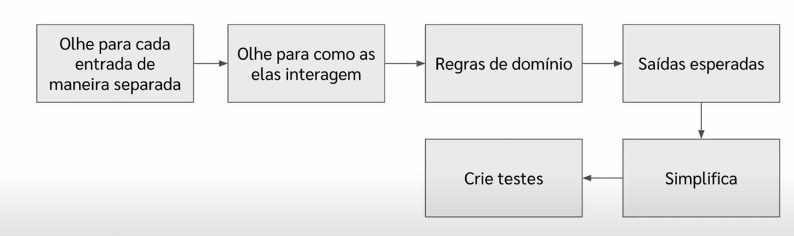

# Casos de Testes

> **Objetivo:** Casos de testes devem tentar encontrar falhas no sistema.

## 📚 Fundamentação Teórica

### How developers Engineer Test Cases: an observation study

**Opções de testes disponíveis:**
- Teste baseado em especificação
- Teste baseado em código

**Descoberta importante:** Somente uma das treze pessoas observadas estruturou os testes de forma sistemática.

### Studying task processes for improving programmer productivity

**Conclusões do estudo:**
- Pessoas experientes tendem a escrever testes de forma sistemática
- Os processos de tarefa usados por programadores de alta produtividade são mais consistentes entre si
- **Conclusão:** Ser sistemático ajuda a aumentar a produtividade

---

## 🎯 Metodologia: Teste Baseado em Especificação

### Processo em 6 Etapas

1. **Analyze as entradas**
   - Verificar casos especiais, exceções, etc.

2. **Analyze as interações**
   - Verificar interações entre entradas que podem gerar resultados inesperados

3. **Identifique regras de domínio**

4. **Defina saídas esperadas**

5. **Simplifique os casos**

6. **Crie os testes**



---

## 💡 Exemplo Prático: Método `intersection`

### Contexto
Método da biblioteca Commons Utils do Java que retorna uma nova lista contendo os elementos presentes em ambas as listas de entrada.

### Especificação

```java
/**
 * Retorna uma nova lista contendo os elementos contidos em ambas as listas
 */
public List<Integer> intersection(List<Integer> list1, List<Integer> list2)
```

**Entradas:**
- `list1`: lista de inteiros
- `list2`: lista de inteiros

**Saída:**
- Lista com elementos em comum

### Etapa 1: Identificar as Entradas

**Características das listas de entrada:**
- `null`
- 0 elementos (vazia)
- 1 elemento
- múltiplos elementos

**Restrições:** Não mencionadas nos requisitos

### Etapa 2: Analisar Interações

**Cenários de interação:**
- **Elementos em comum:**
  - 1 elemento em comum
  - Mais de 1 elemento em comum
- **Sem elementos em comum**

### Etapa 3: Saídas Esperadas

- Lista vazia
- Lista com elementos
- `null` (caso excepcional)

### Etapa 4: Combinações Completas

**Cálculo:** Com todas as combinações possíveis, teríamos **32 casos de teste**.

> ⚠️ **Problema:** Nem sempre é viável criar todos os casos possíveis.

### Etapa 5: Simplificação Estratégica

#### Estratégia de Redução

Para casos excepcionais (null, vazio, etc.), criar **apenas um caso de teste** por categoria:

| Categoria | Subcasos | Estratégia |
|---|---|---|
| **List1 excepcional** | null, vazio, 1 elemento | 1 teste cada |
| **List2 excepcional** | null, vazio, 1 elemento | 1 teste cada |
| **Elementos em comum** | 1 comum, múltiplos comuns | Casos representativos |
| **Sem elementos comuns** | - | Casos representativos |

### Etapa 6: Casos de Teste Finais

#### 🚨 Casos Excepcionais
- `list1 = null`
- `list1 = []` (vazia)
- `list2 = null`
- `list2 = []` (vazia)

#### ✅ Casos com Elementos em Comum

**Um elemento:**
```java
// Ambas com 1 elemento igual
list1 = [1], list2 = [1] → resultado: [1]

// Uma com 1, outra com múltiplos
list1 = [1], list2 = [1,2] → resultado: [1]
list1 = [1,2], list2 = [1] → resultado: [1]
```

**Múltiplos elementos:**
```java
// Interseção parcial
list1 = [1,2,3], list2 = [1,3,5] → resultado: [1,3]

// Interseção total
list1 = [1,2,3], list2 = [1,2,3] → resultado: [1,2,3]
```

#### ❌ Casos sem Elementos em Comum
```java
// Listas com 1 elemento cada
list1 = [1], list2 = [2] → resultado: []

// Listas com múltiplos elementos
list1 = [1,2,3], list2 = [4,5,6] → resultado: []
```

---

## 🎯 Quando Ser Sistemático?

### Critérios para Aplicar a Metodologia

✅ **Use quando:**
- O código possui complexidade evidente
- Há múltiplas interações entre entradas
- O sistema é crítico

❌ **Não é necessário quando:**
- O código é simples e direto
- Poucos cenários possíveis
- Funcionalidades básicas

---

## 💭 Dicas Importantes

> **Mindset correto:** Tentar criar casos de teste sem pensar imediatamente na implementação. Fazer o pré-trabalho de teste baseado em especificação primeiro.

### Processo Recomendado
1. Entenda os requisitos
2. Aplique a metodologia de 6 etapas
3. Crie os casos de teste
4. **Só então** pense na implementação
