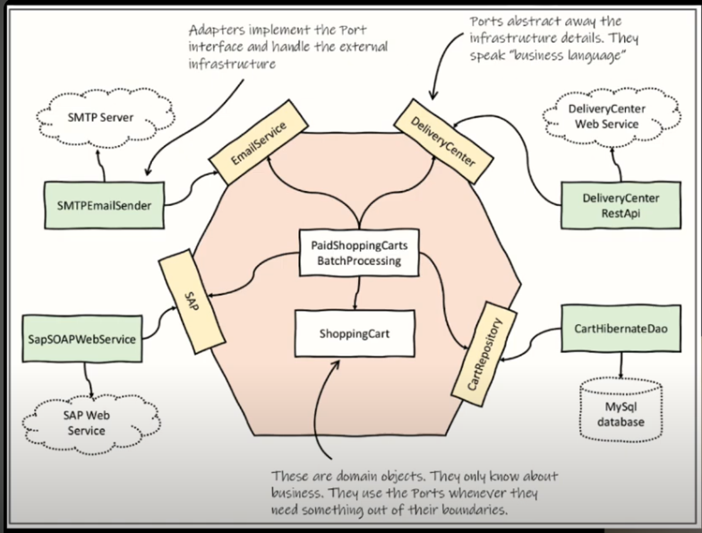

**28-05-25**

# Ports e Adapters

Separar infra estrutura de domínio. é mais facil de mockar, seguir a arquitetura hexagonal, aonde temos portas que são interface que se conectam com as entidade de dominio, e temos os adapters que são as implementações dessas portas, que dependem da infraestrutura.

Esse modelo permite que você teste o domínio sem depender da infraestrutura, tornando os testes mais rápidos e confiáveis.

Os ports falam a liguagem de dominio.

Os  ports devem no mundo ideal não levar em consideração a infraestrutura.

por exemplo no mundo ideal não podemos ter um codigo expondo as logicas envolvidas na utilização de um jdbc, como dependencia no caso do JdbcTemplate.

 

# Controlabilidade e observalidade

é precisar ter o controler sobre os estados de uma funcinalidade, para que seja facil controlar os fluxos de teste, a observalidade é o quão fácil fazer um assert sobre o estado de uma funcionalidade.

# Classes pequenas

é mais facil de testar e entender, classes pequenas te dão a possiblidade de fazer testes de unidades, classes pequenas podemos pensar em um composição de classes, onde cada classe tem uma responsabilidade bem definida. Isso facilita a manutenção e a evolução do código, além de tornar os testes mais simples e diretos.

